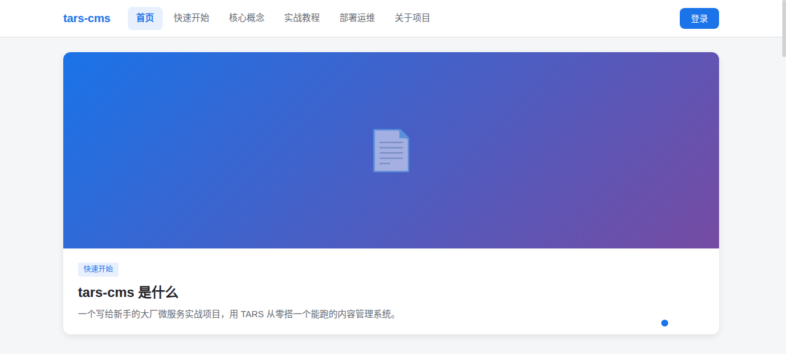
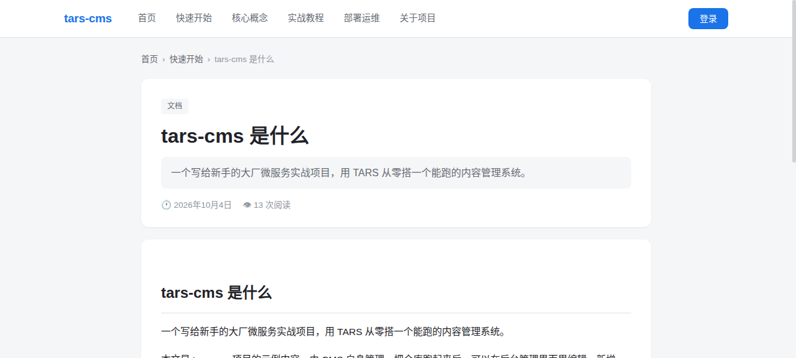
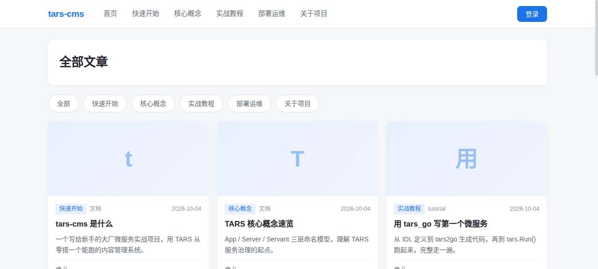
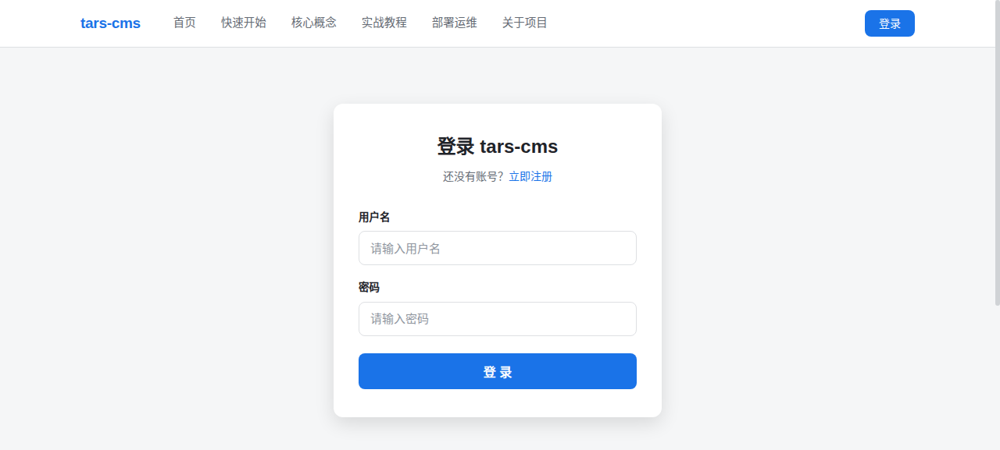
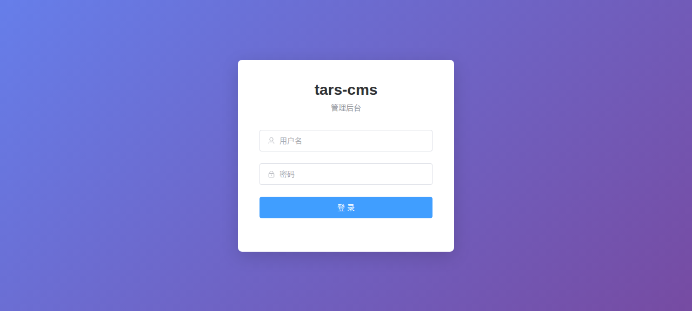
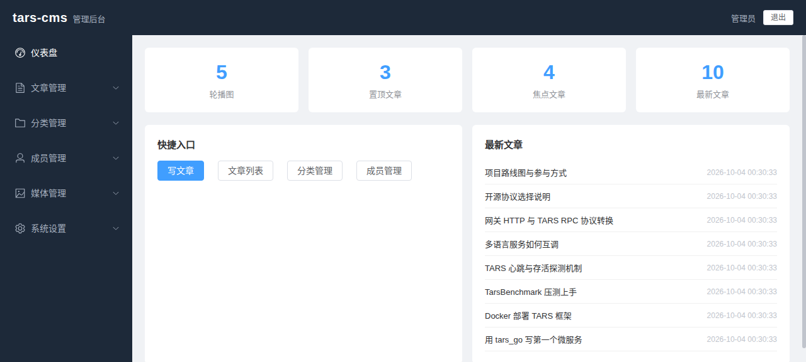
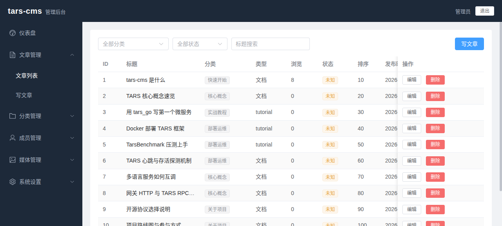
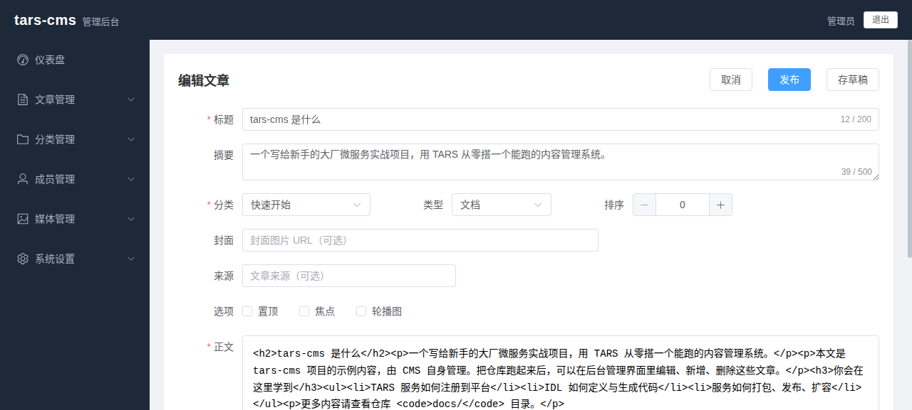

# tars-cms

**中文** | [English](#english)

> **一个写给新手的「大厂微服务」实战项目 —— 用 TARS 从零搭一个真正能跑的内容管理系统。**

---

## 为什么有这个项目

**TARS** 是腾讯自 2008 年起持续使用的后台统一应用框架。它支撑着腾讯 100+ 核心产品、上万台服务节点，具备**百亿级调用**的承载能力。作为 Linux 基金会项目，它同时支持 C++ / Java / Go / Node.js / PHP，并自带一整套服务治理能力：名字服务、配置中心、远程日志、调用统计、无损发布。

但对新手来说，TARS 的学习曲线并不平缓：

- 要先理解 **App / Server / Servant** 三层命名模型
- 要学会写 **TARS IDL**，用 `tars2xxx` 生成各语言代码
- 要搞懂 **模板配置**、**tarsnode 托管**、**心跳与存活探测**
- 要摸清 **打包 → 上传 → 发布 → 扩容** 的完整链路

官方文档很全，但大多是概念讲解与代码片段，**缺一个从头到尾完整跑通、每一步都能看到结果的实例**。

**tars-cms 就是来补这一块的。**

它不是一个玩具 Demo，而是一个结构完整、可直接运行、可拆解、可扩展的内容管理系统。把它的服务拆开看，你就学完了一个 TARS 概念；把它整体跑起来，你就跑通了一套企业级微服务架构。

---

## 项目特点

| 特点 | 说明 |
| --- | --- |
| **真实完整** | 不是 Hello World，而是一个能用的 CMS：内容、分类、媒体、站点配置、用户与权限 |
| **多语言混合** | 每个服务用最合适的语言实现 —— Go 写认证、Java 写业务、C++ 写高性能压测、Node.js 写网关 |
| **分层清晰** | 前端 → 网关 → 业务服务，每层职责单一，边界明确，随便拆掉一层都能看懂 |
| **操作可逆** | 每个部署步骤都是一个独立脚本，配套回滚，改坏了随时能退回去 |
| **压测完备** | 自带 TarsBenchmark，可以亲手验证服务的 QPS、延迟与成功率 |
| **自己介绍自己** | 前端站点的内容就是本项目的文档与教程，由 CMS 自己管理 |

---

## 界面预览

> 以下截图来自项目实际运行环境（网关 `:8200` → CmsWeb `:13103`），非设计稿。

**H5 内容站**（访客侧，手写 CSS，零 UI 库依赖）

| 首页 | 文章详情 |
| --- | --- |
|  |  |

| 分类列表 | 登录 |
| --- | --- |
|  |  |

**Admin 管理后台**（Element Plus，8 个页面）

| 登录 | 仪表盘 |
| --- | --- |
|  |  |

| 文章列表 | 文章编辑（wangEditor） |
| --- | --- |
|  |  |

---

## 架构

```
┌───────────────────────────────────────────────────────────┐
│  浏览器                                                     │
│    │                                                       │
│    ▼                                                       │
│  前端 (Vue 3)   内容站点 + 管理后台                          │
│    │                                                       │
│    ▼                                                       │
│  网关   TarsGateway + BFF                                  │
│    │    · HTTP  ⇄  TARS RPC 协议转换                        │
│    │    · 路由分发 / 限流 / 鉴权校验                          │
│    ▼                                                       │
│  ┌──────────────┬──────────────┬──────────────┐            │
│  │  CMS 服务     │  认证服务      │  压测服务      │           │
│  │  内容 / 分类   │  OIDC / JWT   │  Admin/Node   │           │
│  │  媒体 / 站点   │  用户 / 会话   │  QPS / 延迟    │           │
│  └──────────────┴──────────────┴──────────────┘            │
│          ▲             ▲             ▲                     │
│          └─────────────┴─────────────┘                     │
│                    TARS 平台层                              │
│   服务注册发现 · 配置中心 · 远程日志 · 调用监控 · 无损发布      │
└───────────────────────────────────────────────────────────┘
```

### 目录结构

```
tars-cms/
├── cms/          内容管理服务 —— 文章、分类、媒体、站点配置
├── auth/         认证服务 —— OIDC / JWT / 会话 / 权限
├── gateway/      网关 —— TarsGateway 路由配置 + BFF 聚合层
├── base/         公共基础 —— IDL 定义、共享库、模板配置
├── Benchmark/    压测 —— TarsBenchmark 安装与压测用例
├── deploy/       部署脚本 —— 一个操作一个脚本，全部可逆
└── docs/         项目文档 —— 架构说明与踩坑记录
```

---

## 你会学到什么

| TARS 概念 | 在本项目中的落点 |
| --- | --- |
| **App / Server / Servant** 三层模型 | 每个服务的命名与注册方式 |
| **IDL 与代码生成** | `base/` 下的 `.tars` 接口定义文件 |
| **多语言服务** | `tars_go`（auth）、`tars_java`（cms）、`tars_cpp`（Benchmark） |
| **模板配置** | 服务启动参数的集中管理 |
| **心跳与存活探测** | 认证服务如何让平台稳定识别为 `active` |
| **网关与路由** | `gateway/` 的 HTTP → TARS 转发规则 |
| **发布与扩容** | `deploy/` 的打包、上传、发布、回滚脚本 |
| **压测与容量评估** | `Benchmark/` 实测 QPS 与延迟分位 |

---

## 快速开始

### 1. 部署 TARS 框架

```bash
# 创建网络
docker network create tars

# MySQL
docker run -d --name tars-mysql --net=tars --ip=172.25.0.2 \
  -e MYSQL_ROOT_PASSWORD=<your-password> \
  tarscloud/tars-mysql:latest

# 框架（含 TarsWeb 管理平台）
docker run -d --name tars-framework --net=tars --ip=172.25.0.3 \
  -p 3000:3000 \
  -e MYSQL_HOST=172.25.0.2 \
  -e MYSQL_ROOT_PASSWORD=<your-password> \
  -e INET=eth0 -e SLAVE=false \
  tarscloud/framework:v3.0.11

# 服务节点（业务服务实际运行的机器）
docker run -d --name tars-node --net=tars --ip=172.25.0.5 \
  -e INET=eth0 \
  -e WEB_HOST=http://172.25.0.3:3000 \
  tarscloud/tars-node:latest
```

打开 `http://<你的IP>:3000` 即可看到管理平台。

### 2. 部署本项目服务

```bash
cd deploy
./n01-deploy-auth.sh      # 认证服务
./n02-deploy-cms.sh       # CMS 服务
./n03-config-gateway.sh   # 网关路由
```

每个脚本都可独立运行，并附带对应的回滚说明。

---

## 当前进度

| 模块 | 状态 |
| --- | --- |
| TARS 框架部署（含管理平台） | ✅ 已验证 |
| `auth` 认证服务（Go / OIDC+JWT） | ✅ 已验证运行 |
| `gateway` 网关路由 | ✅ 已验证运行 |
| `Benchmark` 压测 | ✅ 已验证（实测 QPS 与延迟分位） |
| `cms` 内容服务 | 🚧 建设中 |
| 前端站点 | 🚧 建设中 |

> 项目仍在持续建设中，欢迎关注与参与。

---

## 环境要求

- Docker 与 Docker Compose
- 建议 4 核 8G 以上（需同时运行框架、节点与数据库）
- 可选：本地编译需要 Go 1.20+ / JDK 8+ / Node.js 18+ / gcc 9+

---

## 参与贡献

欢迎提交 Issue 与 Pull Request。特别欢迎：

- 补充文档与教程（尤其是新手容易踩的坑）
- 增加新的 TARS 服务示例（其他语言、其他场景）
- 改进部署脚本的健壮性

---

## 开源协议

本项目采用 **GNU General Public License v3.0**，详见 [LICENSE](LICENSE)。

---

## 致谢

- [TARS](https://github.com/TarsCloud) —— 腾讯开源的高性能微服务框架
- [gosso](https://github.com/rushairer/gosso) —— Go 语言 OIDC/OAuth2 身份服务
- [TarsGateway](https://github.com/TarsCloud/TarsGateway) —— TARS 通用 API 网关
- [TarsBenchmark](https://github.com/TarsCloud/TarsBenchmark) —— TARS 专用压测工具

---

<br>

# English

[中文](#tars-cms) | **English**

> **A hands-on microservice project for beginners — build a real, running CMS on Tencent TARS from scratch.**

---

## Why This Project

**TARS** is the unified backend application framework Tencent has used continuously since 2008. It powers 100+ core products across tens of thousands of service nodes, with the capacity to handle **tens of billions of calls**. As a Linux Foundation project, it supports C++ / Java / Go / Node.js / PHP out of the box, and ships with a complete service-governance suite: naming service, config center, remote logging, call statistics, and zero-downtime releases.

But the learning curve is steep for newcomers:

- You must first grasp the **App / Server / Servant** three-level naming model
- You need to write **TARS IDL** and generate code via `tars2xxx` for each language
- You have to understand **template configuration**, **tarsnode hosting**, and **heartbeat / liveness probing**
- You must figure out the full **package → upload → publish → scale** pipeline

The official documentation is thorough, but it is mostly concepts and snippets. **What is missing is a complete, end-to-end example where every step produces a visible result.**

**tars-cms fills that gap.**

It is not a toy demo, but a full-featured, runnable, decomposable, and extensible content management system. Take its services apart, and you have learned one TARS concept each. Run the whole thing, and you have operated a production-grade microservice architecture.

---

## Highlights

| Highlight | Description |
| --- | --- |
| **Real and complete** | Not a Hello World — a working CMS with content, categories, media, site config, users and permissions |
| **Polyglot by design** | Each service uses the most fitting language: Go for auth, Java for business, C++ for high-performance benchmarking, Node.js for the gateway |
| **Clean layering** | Frontend → Gateway → Business services. Single responsibility per layer, clear boundaries — remove any layer and it is still understandable |
| **Reversible operations** | Every deployment step is a standalone script with a matching rollback |
| **Benchmarking included** | Ships with TarsBenchmark so you can measure QPS, latency and success rate yourself |
| **Self-documenting** | The frontend site's content *is* this project's documentation and tutorials, managed by the CMS itself |

---

## Screenshots

> Captured from a live deployment (`:8200` gateway → `:13103` CmsWeb), not design mocks.

**H5 Content Site** (Visitor-facing, handwritten CSS, zero UI libraries)

| Home | Article Detail |
| --- | --- |
|  |  |

| Category List | Login |
| --- | --- |
|  |  |

**Admin Dashboard** (Element Plus, 8 pages)

| Login | Dashboard |
| --- | --- |
|  |  |

| Article List | Article Editor (wangEditor) |
| --- | --- |
|  |  |

---

## Architecture

```
┌───────────────────────────────────────────────────────────┐
│  Browser                                                  │
│    │                                                      │
│    ▼                                                      │
│  Frontend (Vue 3)   Content site + Admin console           │
│    │                                                      │
│    ▼                                                      │
│  Gateway   TarsGateway + BFF                              │
│    │    · HTTP  ⇄  TARS RPC protocol conversion            │
│    │    · Routing / rate limiting / auth checks            │
│    ▼                                                      │
│  ┌──────────────┬──────────────┬──────────────┐           │
│  │  CMS Service  │  Auth Service │  Benchmark    │          │
│  │  content      │  OIDC / JWT   │  Admin/Node   │          │
│  │  media / site │  users/session│  QPS / latency│          │
│  └──────────────┴──────────────┴──────────────┘           │
│          ▲             ▲             ▲                    │
│          └─────────────┴─────────────┘                    │
│                    TARS Platform Layer                    │
│   Service discovery · Config center · Remote log ·         │
│   Call monitoring · Zero-downtime release                  │
└───────────────────────────────────────────────────────────┘
```

### Directory Layout

```
tars-cms/
├── cms/          Content service — articles, categories, media, site config
├── auth/         Auth service — OIDC / JWT / sessions / permissions
├── gateway/      Gateway — TarsGateway routing + BFF aggregation layer
├── base/         Shared foundation — IDL definitions, shared libs, templates
├── Benchmark/    Benchmarking — TarsBenchmark setup and test cases
├── deploy/       Deployment scripts — one script per operation, all reversible
└── docs/         Documentation — architecture notes and pitfalls
```

---

## What You Will Learn

| TARS Concept | Where It Lives in This Project |
| --- | --- |
| **App / Server / Servant** model | Naming and registration of each service |
| **IDL and code generation** | `.tars` interface files under `base/` |
| **Polyglot services** | `tars_go` (auth), `tars_java` (cms), `tars_cpp` (Benchmark) |
| **Template configuration** | Centralized management of service startup parameters |
| **Heartbeat and liveness probing** | How the auth service stays reliably `active` |
| **Gateway and routing** | HTTP → TARS forwarding rules in `gateway/` |
| **Release and scaling** | Packaging, upload, publish and rollback scripts in `deploy/` |
| **Benchmarking and capacity planning** | Real QPS and latency percentiles in `Benchmark/` |

---

## Quick Start

### 1. Deploy the TARS Framework

```bash
# Create the network
docker network create tars

# MySQL
docker run -d --name tars-mysql --net=tars --ip=172.25.0.2 \
  -e MYSQL_ROOT_PASSWORD=<your-password> \
  tarscloud/tars-mysql:latest

# Framework (includes the TarsWeb management console)
docker run -d --name tars-framework --net=tars --ip=172.25.0.3 \
  -p 3000:3000 \
  -e MYSQL_HOST=172.25.0.2 \
  -e MYSQL_ROOT_PASSWORD=<your-password> \
  -e INET=eth0 -e SLAVE=false \
  tarscloud/framework:v3.0.11

# Service node (where your business services actually run)
docker run -d --name tars-node --net=tars --ip=172.25.0.5 \
  -e INET=eth0 \
  -e WEB_HOST=http://172.25.0.3:3000 \
  tarscloud/tars-node:latest
```

Open `http://<your-ip>:3000` to access the console.

### 2. Deploy This Project's Services

```bash
cd deploy
./n01-deploy-auth.sh      # Auth service
./n02-deploy-cms.sh       # CMS service
./n03-config-gateway.sh   # Gateway routing
```

Each script runs standalone and documents its own rollback procedure.

---

## Status

| Module | Status |
| --- | --- |
| TARS framework deployment (with console) | ✅ Verified |
| `auth` service (Go / OIDC+JWT) | ✅ Verified running |
| `gateway` routing | ✅ Verified running |
| `Benchmark` | ✅ Verified (measured QPS and latency) |
| `cms` content service | 🚧 In progress |
| Frontend site | 🚧 In progress |

> The project is under active development. Stars and contributions are welcome.

---

## Requirements

- Docker and Docker Compose
- 4 cores / 8 GB RAM recommended (framework, node and database run together)
- Optional, for local builds: Go 1.20+ / JDK 8+ / Node.js 18+ / gcc 9+

---

## Contributing

Issues and pull requests are welcome. Especially appreciated:

- Documentation and tutorials (particularly common beginner pitfalls)
- New TARS service examples (other languages, other use cases)
- More robust deployment scripts

---

## License

Released under the **GNU General Public License v3.0**. See [LICENSE](LICENSE).

---

## Credits

- [TARS](https://github.com/TarsCloud) — Tencent's open-source high-performance microservice framework
- [gosso](https://github.com/rushairer/gosso) — OIDC/OAuth2 identity service in Go
- [TarsGateway](https://github.com/TarsCloud/TarsGateway) — General-purpose API gateway for TARS
- [TarsBenchmark](https://github.com/TarsCloud/TarsBenchmark) — Benchmarking tool built for TARS
